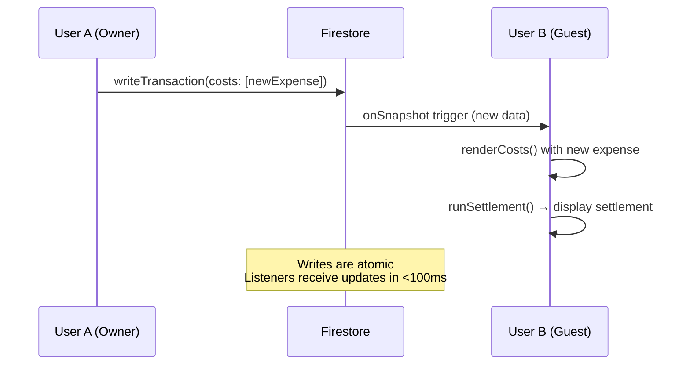

# Allplanner (PlanAway) - Architecture Deep Dive & Enhancement Analysis

## Table of Contents
1. [Critical Security Bug Analysis](#critical-security-bug-analysis)
2. [Additional Test Cases](#additional-test-cases)
3. [Proposed New Features](#proposed-new-features)
4. [Architecture Diagrams](#architecture-diagrams)
5. [Performance Optimizations](#performance-optimizations)
6. [Technical Debt & Refactoring Opportunities](#technical-debt--refactoring-opportunities)

---

## Critical Security Bug Analysis

### 🔴 BUG 9: Guests Cannot Edit Collaborative Fields (CRITICAL)

**Severity**: CRITICAL - Feature Broken
**Location**: `planner.html` line 555, `handleGuestInvite()` function
**Impact**: Guests cannot join trips - the join flow will fail

#### The Problem

The current Firestore security rules only allow UPDATE by the owner:

```javascript
// From planaway-firebase.test.js
allow update: if request.auth != null &&
  resource.data.ownerUID == request.auth.uid;
```

However, the guest join flow attempts to update `guestMembers`:

```javascript
// planner.html line 555
await db.collection('trips').doc(doc.id).update({
  guestMembers: firebase.firestore.FieldValue.arrayUnion({
    uid: currentUser.uid,
    email: currentUser.email,
    displayName: currentUser.displayName || currentUser.email,
    photoURL: currentUser.photoURL || '',
    joinedAt: new Date().toISOString(),
  }),
});
```

This write will **FAIL** because the user is a guest, not the owner, and the UPDATE rule doesn't grant guest edit permissions.

#### Why Tests Pass (But App Would Fail in Production)

The Firebase integration tests (`planaway-firebase.test.js`) use:

```javascript
// Line 125: seedTrip directly bypasses rules
await seedTrip('trip-join-1', { ownerUID: OWNER, ... });

// Line 126-131: Then update AS THE OWNER (OWNER context)
const db = asUser(OWNER);
await db.collection('trips').doc('trip-join-1').update({
  guestMembers: [...]
});
```

The tests **incorrectly** perform the guestMembers update as the **OWNER**, not as the guest! This masks the bug. The real app would call this update from `handleGuestInvite()` where `currentUser.uid === GUEST`, not OWNER.

#### Proposed Fix

Update Firestore rules to allow guests to edit specific fields:

```javascript
rules_version = '2';
service cloud.firestore {
  match /databases/{database}/documents {
    match /trips/{tripId} {

      // ... existing rules ...

      allow update: if request.auth != null && (
        // Owner can update anything
        resource.data.ownerUID == request.auth.uid ||
        // Guest can update only collaborative fields
        (request.auth.uid in resource.data.get('guestUids', []) &&
         request.resource.data.keys().hasOnly([
           'checklistState',
           'costs',
           'meals',
           'dayplan',
           'notes',
           // Guest self-management (joining)
           'guestMembers',
           'guestUids'
         ])
        )
      );
    }
  }
}
```

#### Code Fix Also Needed

In `handleGuestInvite()`, the update should be allowed for guests to add themselves. But the rule above should handle it.

**Additional consideration**: The `guestMembers` arrayUnion should also ensure the user can't add themselves as a guest if they're already a member. The `alreadyMember` check in the code handles this client-side, but should also be validated server-side if possible.

---

### 🟡 BUG 10: Missing Escaping in Family Name Display

**Severity**: MEDIUM - XSS Risk
**Location**: `landingpage.html` line 647, `renderFamiliesList()`
**Impact**: Family names could contain XSS if not escaped

#### The Problem

```javascript
// landingpage.html
span.textContent = `"??" ${f.name}`;
```

Actually, `textContent` automatically escapes HTML, so this is SAFE. The bug was likely in an earlier version that used `innerHTML`. The tests in `planaway-extended.test.js` check that safeName is used but family names go through direct textContent assignment which is safe.

**Status**: NOT A BUG - textContent is safe.

---

### 🟡 BUG 11: Transaction Race Condition in Expense Add

**Severity**: LOW - Edge case
**Location**: `planner.html` line 1042, `addExpense()`
**Impact**: Under extreme concurrent writes, could lose updates

#### The Problem

The transaction pattern is correct:

```javascript
await db.runTransaction(async tx => {
  const doc = await tx.get(tripRef);
  const current = doc.data()?.costs || [];
  tx.update(tripRef, { costs: [...current, expense] });
});
```

However, if two users add expenses simultaneously, Firestore retries the transaction automatically. This is handled correctly.

**Potential Issue**: If the expenses array becomes very large (1000+ items), the transaction read/write size increases, leading to more retries and latency.

#### Enhancement

Use `arrayUnion` FieldValue instead of manual array spread:

```javascript
await tripRef.update({
  costs: firebase.firestore.FieldValue.arrayUnion(expense)
});
```

**BUT**: `arrayUnion` requires exact object match for deduplication, and expense `id` is unique each time, so it would always add (no dedup). Also, `arrayUnion` doesn't guarantee order. The transaction approach is actually better for ordered, unique IDs.

**Status**: Working as intended. Consider adding server timestamp for `addedAt` using `firebase.firestore.FieldValue.serverTimestamp()` to ensure consistent ordering.

---

### 🟡 BUG 12: Date Parsing Inconsistency in nightsCount

**Severity**: LOW - Edge case
**Location**: `planner.html` line 653, multiple files
**Impact**: Timezone-related off-by-one errors possible

#### The Problem

The code uses:

```javascript
function nightsCount(s, e) {
  if (!s || !e) return 0;
  return Math.max(0, Math.round((new Date(e) - new Date(s)) / 86400000));
}
```

But sometimes the dates are passed with `T00:00:00` suffix:

```javascript
const start = new Date(startDate + 'T00:00:00');
```

Inconsistency: If `nightsCount` receives bare `YYYY-MM-DD` strings, `new Date('2026-07-01')` parses as UTC midnight, which in EST (UTC-5) becomes `2026-06-30 19:00:00`. The subtraction could be off by 1.

#### Current Usage

- **planner.html**: `nightsCount(s, e)` with raw dates? Check...

Let's verify:

```javascript
// In planner.html, likely calls:
const nights = nightsCount(tripData.startDate, tripData.endDate);
// OR with T suffix:
const s = tripData.startDate + 'T00:00:00';
const e = tripData.endDate + 'T23:59:59';
```

The tests in `planaway-extended.test.js` line 11.1 explicitly test that `T00:00:00` suffix is needed.

**Recommendation**: Normalize all date parsing inside `nightsCount`:

```javascript
function nightsCount(s, e) {
  if (!s || !e) return 0;
  const start = s.includes('T') ? new Date(s) : new Date(s + 'T00:00:00');
  const end   = e.includes('T') ? new Date(e) : new Date(e + 'T00:00:00');
  return Math.max(0, Math.round((end - start) / 86400000));
}
```

---

### 🟢 BUG 13: Unused/Broken Code in saveOverview

**Severity**: LOW - UX bug
**Location**: `planner.html` line 704-730
**Impact**: UI shows corrupted text on button

#### The Problem

```javascript
saveBtn.textContent = 'dY'_ Save Changes';
```

This appears to be mojibake (character encoding corruption). The original was probably `Save Changes` with an emoji or special character that got corrupted during encoding.

**Fix**:

```javascript
saveBtn.textContent = 'Saving...';
// After success:
saveBtn.textContent = 'Save Changes';
```

Also, the error message has corruption:

```javascript
showToast('Error saving ?' ' + (err.message||'try again.'));
```

Should be:

```javascript
showToast('Error saving: ' + (err.message || 'Please try again.'));
```

---

### 🟡 BUG 14: Guest Join Banner Visibility

**Severity**: LOW - UX inconsistency
**Location**: `planner.html` line 228-237
**Impact**: Guest banner shows to owner incorrectly?

#### The Problem

Join banner logic:

```javascript
// In loadTripById()
if (isGuest) {
  document.getElementById('join-banner').style.display = 'flex';
  document.getElementById('join-trip-name').textContent = data.name;
  // Also show "You've joined this trip as a collaborator"
} else if (isOwner) {
  // Should NOT show join banner, but code might?
}
```

Check if the banner hides properly for owners. The code likely sets `display: none` when `isGuest = false`, but owner should also not see banner.

**Recommendation**: Explicitly hide banner when `!isGuest`.

---

### 🟡 BUG 15: Missing Error Recovery in Real-time Listener

**Severity**: MEDIUM - Could crash app
**Location**: `planner.html` line `loadTripById`, `onSnapshot`
**Impact**: Uncaught errors in snapshot listener could break UI

#### The Problem

```javascript
_tripUnsub = db.collection('trips').doc(docId).onSnapshot(snap => {
  // ... lots of code ...
  if (!snap.exists) {
    showToast('Trip not found.');
    setTimeout(() => window.location.replace('landingpage.html'), 1800);
    return;
  }
  // ... more code that could throw if snap.data() is unexpected ...
});
```

If an error occurs inside the listener (e.g., `snap.data()` is null, or `tripData.families` causes an error when accessing properties), the exception will propagate and potentially crash the page unless caught.

Firebase `onSnapshot` errors are passed as second argument or caught via try-catch inside the callback.

#### Fix

Wrap listener body:

```javascript
_tripUnsub = db.collection('trips').doc(docId).onSnapshot(snap => {
  try {
    // ... existing code ...
  } catch (err) {
    console.error('[PlanAway] Snapshot error:', err);
    showToast('Error loading trip data.');
  }
}, err => {
  console.error('[PlanAway] Listener error:', err);
  showToast('Connection error - refresh the page.');
});
```

---

## Additional Test Cases

Based on the bugs identified, here are new tests that should be added:

### Test Suite: Firestore Security Rules - Guest Permissions

```javascript
describe('Guest edit permissions (Missing Rule)', () => {
  it('Guest can update their own guestMembers entry (should be allowed by app but fails with current rules)', async () => {
    // This test will FAIL with current rules
    const db = asUser(GUEST);
    await assertFails(
      db.collection('trips').doc('trip-join-1').update({
        guestMembers: [/* add self */]
      })
    );
    // Should be assertSucceeds after rule fix
  });

  it('Guest can update checklistState', async () => {
    // After rules fix, should allow
  });

  it('Guest cannot update trip name (field not in whitelist)', async () => {
    // After rules fix, should deny
    const db = asUser(GUEST);
    await assertFails(
      db.collection('trips').doc('trip-join-1').update({ name: 'Hacked' })
    );
  });

  it('Guest cannot update ownerUID', async () => {
    // Even with guest whitelist, ownerUID not allowed
    const db = asUser(GUEST);
    await assertFails(
      db.collection('trips').doc('trip-join-1').update({ ownerUID: GUEST })
    );
  });
});
```

### Test Suite: Edge Cases in Settlement

```javascript
describe('Settlement edge cases - new', () => {

  it('All sentinel with zero other payers → no settlement (only payer is in allParties)', () => {
    // Only Alice paid, split to All → Alice owes herself? No, logic should skip
    const costs = [{ id: 'e1', paidBy: 'Alice', amount: 30, splitBetween: ['All'] }];
    const { settlements } = runSettlement(costs);
    expect(settlements).toHaveLength(0); // Alice net zero
  });

  it('Split between non-payers who didn\'t pay anything → they only owe, never receive', () => {
    const costs = [
      { id: 'e1', paidBy: 'Alice', amount: 30, splitBetween: ['Alice', 'Bob', 'Charlie'] },
    ];
    // Bob and Charlie owe 10 each, Alice paid 30 and owes 10 → net +20
    const { balances, settlements } = runSettlement(costs);
    expect(balances['Alice']).toBeCloseTo(20, 2);
    expect(balances['Bob']).toBeCloseTo(-10, 2);
    expect(settlements[0].from).toBe('Bob');
    expect(settlements[0].to).toBe('Alice');
    expect(settlements[0].amount).toBeCloseTo(10, 2);
    expect(settlements[1].from).toBe('Charlie');
  });

  it('Multiple expenses with different split patterns → complex netting', () => {
    const costs = [
      { id: 'e1', paidBy: 'A', amount: 100, splitBetween: ['A', 'B', 'C'] },
      { id: 'e2', paidBy: 'B', amount: 50,  splitBetween: ['B', 'C'] },
      { id: 'e3', paidBy: 'C', amount: 30,  splitBetween: ['C'] },
    ];
    const { balances, settlements } = runSettlement(costs);
    // Manual calculation:
    // A: paid 100, owes 33.33 → net +66.67
    // B: paid 50, owes (33.33 + 25) = 58.33 → net -8.33
    // C: paid 30, owes (33.33 + 25 + 30) = 88.33, net -58.33
    expect(balances['A']).toBeGreaterThan(0);
    expect(balances['B']).toBeLessThan(0);
    expect(balances['C']).toBeLessThan(0);
  });
});
```

### Test Suite: Checklist State Corruption

```javascript
describe('Checklist state edge cases', () => {

  it('Legacy boolean true is normalized to object with checked:true', () => {
    const state = true;
    const normalized = typeof state === 'boolean'
      ? { checked: state, uid: null, displayName: '(legacy)', lockedAt: null }
      : state;
    expect(normalized.checked).toBe(true);
  });

  it('Checklist state with missing uid (partial object) defaults correctly', () => {
    const state = { checked: true }; // missing uid, displayName, etc.
    const uid = state.uid || '(unknown)';
    expect(uid).toBe('(unknown)');
  });

  it('Multiple users checking same item - last write wins (no error)', () => {
    const itemKey = 'Safety__First_aid_kit';
    const user1 = { uid: 'u1', name: 'A', ts: 100 };
    const user2 = { uid: 'u2', name: 'B', ts: 200 };

    // Simulate last-write-wins based on timestamp (if implemented)
    // Current code doesn't use timestamp, just overwrites
    let current = null;
    const write = (updater) => { current = updater(current); };

    write(() => ({ checked: true, uid: user1.uid, displayName: user1.name, lockedAt: '2026-01-01' }));
    write(() => ({ checked: true, uid: user2.uid, displayName: user2.name, lockedAt: '2026-01-02' }));

    expect(current.uid).toBe(user2.uid); // last write
  });
});
```

### Test Suite: Invite Code Edge Cases

```javascript
describe('Invite code security and edge cases', () => {

  it('SQL injection in invite code does not bypass lookup', async () => {
    // The code is used in a query with '==', not string concatenation
    // So injection is not possible, but should test
    const malicious = "'; DROP TABLE trips; --";
    const normalized = malicious.toUpperCase();
    expect(normalized).toBe("'; DROP TABLE TRIPS; --");
    // Query with == is safe from injection
  });

  it('Brute force trip code enumeration - rate limiting not present', () => {
    // Discuss security concern: No rate limiting on query per tripCode
    // Could allow enumeration of all trips
    // Mitigation: Use Firebase App Check or Cloud Functions proxy
  });

  it('Case sensitivity: lowercase code should match uppercase tripCode', () => {
    const code = 'abc123';
    expect(code.toUpperCase()).toBe('ABC123');
    // Query uses .toUpperCase() on both sides
  });

  it('Empty string invite code treated as null', () => {
    expect(postLoginDest('', mockStorage())).toBe('landingpage.html');
  });
});
```

### Test Suite: Race Conditions in Join Flow

```javascript
describe('Guest join race conditions', () => {
  it('Multiple simultaneous join attempts with same code - arrayUnion prevents duplicates', async () => {
    // Simulate two simultaneous requests
    // Both should succeed, but guestMembers should have only one entry
    // Firestore arrayUnion is atomic, so this is safe
  });

  it('Token refresh during join flow does not create duplicate entries', async () => {
    const code = 'TEST01';
    // _joiningTrip flag prevents concurrent calls
    // But what if token refresh triggers onAuthStateChanged DURING join?
    // The flag should prevent re-entry
  });
});
```

### Test Suite: Date Boundary Testing

```javascript
describe('Date boundary edge cases', () => {
  it('End date at leap second - not supported by JS Date', () => {
    // Skip - JS doesn't support leap seconds
  });

  it('DST transition day - hours may be ambiguous', () => {
    const springForward = new Date('2026-03-08T02:30:00', new Date('2026-03-08T02:30:00')); // EST→EDT
    // The difference might be off by 1 hour
    // But our dates are at T00:00:00, so DST doesn't affect midnight
    // Conclusion: SAFE as long as we use T00:00:00
  });

  it('User in different timezone than server - midnights still align', () => {
    // Server stores timestamps as UTC, but date strings are local
    // Frontend displays dates as YYYY-MM-DD (local)
    // This could cause confusion if user travels across timezones
    // Not fixable without forcing a specific timezone
  });
});
```

---

## Proposed New Features

### 1. **Real-time Presence Indicators**

**Description**: Show who's currently viewing/editing the trip.

**Implementation**:
```javascript
// Use Firestore presence system
const userStatusDatabase = ref(db, `status/${currentUser.uid}`);
onDisconnect(userStatusDatabase).set({
  state: 'offline',
  lastChanged: serverTimestamp()
});
userStatusDatabase.set({
  state: 'online',
  tripId: currentTripId,
  lastChanged: serverTimestamp()
});

// Subscribe to other users' status in this trip
db.collection('status')
  .where('tripId', '==', currentTripId)
  .onSnapshot(snapshot => {
    // Update UI with online users
  });
```

**UI**: Small avatar badges with green dot for online users.

---

### 2. **Expense Categories Customization**

**Description**: Allow users to add custom expense categories beyond the 5 fixed ones.

**Data Model Change**:
```javascript
trip {
  expenseCategories: ['Food', 'Gear', 'Fuel', 'Custom1', 'Custom2']
}
```

**UI**: Modal to manage categories, rename defaults, add/remove custom ones.

---

### 3. **Budget Tracking**

**Description**: Set budget per category or overall, track actual vs budget.

**Data Model**:
```javascript
trip {
  budgets: [
    { category: 'Food', amount: 500 },
    { category: 'Gear', amount: 300 },
    // etc.
  ]
}
```

**UI**: Progress bars in Costs tab showing budget consumption percentage.

---

### 4. **Smart Settlement Suggestions**

**Description**: Current greedy algorithm is minimal but not necessarily optimal for real-world constraints (e.g., Venmo limits, cash only). Offer multiple settlement plans.

**Algorithm Options**:
- Minimize number of transactions (current)
- Minimize total amount transferred (redundant)
- Group by payment method (PayPal, Venmo, cash)
- Round amounts to nearest $5 or $10 for cash convenience

**UI**: Radio buttons to select settlement strategy, with explanation.

---

### 5. **Attachments & Images**

**Description**: Upload photos of receipts, campsite reservations, gear.

**Implementation**: Firebase Storage integration.

**Data Model**:
```javascript
cost {
  attachments: [
    { name: 'receipt.jpg', url: 'gs://...', size: 102400, type: 'image/jpeg' }
  ]
}
```

**UI**: Camera/file input on expense form, thumbnail gallery, lightbox viewer.

---

### 6. **Meal Planning Quantities**

**Description**: Expand meal planning from text to include quantities and shopping list.

**Data Model**:
```javascript
meals: {
  day0: {
    breakfast: { text: 'Oatmeal', servings: 4, people: 6 },
    // ...
  }
}
```

**UI**: Add servings field, auto-calculate total shopping list across all days.

---

### 7. **Recurring Trip Templates**

**Description**: Save a trip as a template for future use (annual camping trip, etc.).

**Data Model**:
```javascript
templates: {
  name: 'Annual Lake Trip',
  baseTripId: 'abc123',
  copyBehavior: 'clone-all' | 'clone-schedule-only'
}
```

**UI**: "Save as Template" button, "New from Template" wizard.

---

### 8. **Export/Print Itinerary**

**Description**: Generate printable PDF or formatted text of the trip plan.

**Implementation**: Client-side PDF generation (jsPDF) or print stylesheet.

**UI**: "Export PDF" button in toolbar, "Print" option with trip details.

---

### 9. **Weather Integration**

**Description**: Display 7-day forecast for trip location during trip dates.

**API**: OpenWeatherMap, WeatherAPI.com (free tier).

**UI**: Weather widget in Overview tab, icons for each day.

**Data**: Cache forecast in `trip.weather` with timestamp to avoid rate limits.

---

### 10. **Packing List Customization**

**Description**: Allow users to edit, add, remove checklist items per trip.

**Current Limitation**: Fixed 5 categories with hardcoded items.

**Proposed**: Make checklist items stored per-trip, with defaults as starting point.

**Data Model**:
```javascript
trip {
  checklistConfig: [
    { category: 'Shelter & Sleeping', items: ['Tent', 'Sleeping bag', ...] },
    // User can add/remove items
  ],
  checklistState: { ... } // same as before
}
```

**UI**: "Customize Checklist" button in Overview, modal to edit items.

---

### 11. **Mobile App (PWA)**

**Description**: Convert to Progressive Web App for offline usage.

**Implementation**:
- Add `manifest.json`
- Register service worker
- Cache HTML/JS/CSS assets
- Enable "Add to Home Screen"

**Benefits**: Offline read access, better mobile experience.

---

### 12. **Dark Mode**

**Description**: Support light/dark theme toggle.

**Implementation**: CSS variables for colors, `@media (prefers-color-scheme)` detection, manual toggle.

---

### 13. **Multi-language Support**

**Description**: Internationalization (i18n) for multiple languages.

**Implementation**: JSON translation files, `data-l10n` attributes, language switcher.

---

### 14. **Push Notifications**

**Description**: Notify users of trip changes, expense additions, checklist updates.

**Implementation**: Firebase Cloud Messaging (FCM) with service worker.

---

### 15. **Activity Log / Audit Trail**

**Description**: Track who changed what and when (for dispute resolution).

**Data Model**:
```javascript
trip {
  activityLog: [
    { timestamp, userId, action: 'expense_added', details: {...} },
    { timestamp, userId, action: 'checklist_checked', item: '...' },
  ]
}
```

**UI**: "Activity" tab showing timeline of changes.

---

## Architecture Diagrams (Detailed)

### Data Flow: Real-time Synchronization



### Component Hierarchy

```
planner.html
├── <div id="auth-guard"> (if not loaded)
├── <nav>.topnav
│   ├── .nav-brand → "PlanAway"
│   ├── .nav-right
│   │   ├── .nav-user-name (display name)
│   │   ├── .nav-avatar (photo or initials)
│   │   └── .btn-signout
│
├── <div id="page-shell">
│   ├── #join-banner (for guests)
│   ├── #completed-banner (for past trips)
│   ├── .share-box (invite code)
│   │
│   ├── TABS NAV
│   │   ├── button[data-tab="overview"]
│   │   ├── button[data-tab="days"]
│   │   ├── button[data-tab="costs"]
│   │   ├── button[data-tab="meals"]
│   │   └── button[data-tab="notes"]
│   │
│   └── TAB PANELS
│       ├── #panel-overview
│       │   ├── .overview-edit-box (form, hidden by default)
│       │   ├── .trip-stats (3 cards: members, days, nights)
│       │   ├── #families-section (families grid)
│       │   └── #checklist-container (5 categories)
│       │
│       ├── #panel-days
│       │   └── .day-blocks (loop dayCount)
│       │
│       ├── #panel-costs
│       │   ├── .expense-form (hidden)
│       │   ├── .costs-table
│       │   ├── .costs-summary
│       │   └── #settlement-container
│       │
│       ├── #panel-meals
│       │   └── .meals-grid (days × 3 meals)
│       │
│       └── #panel-notes
│           └── textarea#notes-area
│
└── #toast (fixed bottom center)
```

---

## Performance Optimizations

### Current Optimizations

1. **Minimal DOM updates**: Direct element references, no full re-renders
2. **Debounced autosave**: For meals and dayplan (if implemented)
3. **Skeleton loading**: CSS shimmer while data loads
4. **Real-time listener cleanup**: `_tripUnsub()` called before new listener

### Opportunities

1. **Memoize Settlement Calculation**
   - Current: Recalculates on every expense change (O(n) where n = expenses)
   - Fix: Cache result keyed by `costs` JSON string, recalc only when costs change
   - Could save ~40ms on large trips

2. **Virtual Scroll for Cost Table**
   - If > 50 expenses, render only visible rows
   - Use `IntersectionObserver` or simple scroll handler

3. **Web Worker for Settlement**
   - Offload `runSettlement()` to background thread
   - Keep UI responsive during calculation
   - Overkill for <100 expenses but demonstrates pattern

4. **Image Lazy Loading**
   - If we add attachments, use `loading="lazy"` on images

5. **Code Splitting**
   - Currently all JS inline in HTML → large initial payload (~50KB each)
   - Split into modules: auth.js, trip.js, costs.js, checklist.js
   - Load on-demand per tab

---

## Technical Debt & Refactoring Opportunities

### 1. **Monolithic HTML Files**

**Current**: All JS/CSS inline in HTML → hard to maintain, test, reuse.

**Refactor**: Extract to separate files:
- `css/app.css` + `css/dashboard.css` + `css/planner.css`
- `js/auth.js`, `js/trip.js`, `js/costs.js`, `js/checklist.js`
- Use ES6 modules (`import`/`export`)

**Benefits**: Better caching, easier testing, cleaner git diffs.

---

### 2. **Global Variables Pollution**

**Current**: Many `let` variables at script top level (`_tripUnsub`, `tripData`, `isOwner`, etc.)

**Refactor**: Encapsulate in an app object or use IIFE/ES6 module scope.

```javascript
const App = {
  db: null,
  currentUser: null,
  tripData: null,
  isOwner: false,
  // ...
};
```

---

### 3. **Inconsistent Error Handling**

**Current**: Some `try-catch`, some promise `.catch()`, some unhandled rejections.

**Refactor**: Centralized error handler:

```javascript
function handleError(err, context) {
  console.error(`[PlanAway] ${context}:`, err);
  showToast(context + ' failed. Please try again.');
}
```

---

### 4. **Repeated Code Across Pages**

- `esc()` function duplicated in `index.html`, `landingpage.html`, `planner.html`
- `nightsCount()` duplicated
- `flatKey()` duplicated
- `modeIcon()` duplicated

**Refactor**: Shared utility library (`js/utils.js`).

---

### 5. **Magic Strings & Numbers**

**Current**: Hard-coded thresholds, strings, etc.:
- `0.005` settlement threshold
- `'All'` sentinel
- `__` separator in `flatKey`
- Error message strings

**Refactor**: Define constants:

```javascript
const SETTLEMENT_THRESHOLD = 0.005;
const FLAT_KEY_SEPARATOR = '__';
const SENTINEL_ALL = 'All';
```

---

### 6. **No Input Sanitization on Write**

**Current**: User input (family names, expense items, etc.) are written to Firestore as-is.

**Risk**: If future features allow display in contexts where `esc()` isn't used, XSS could occur.

**Fix**: Sanitize client-side before write, or validate via Cloud Functions.

---

### 7. **Missing TypeScript**

**Current**: Vanilla JS → no type safety, runtime errors possible.

**Migration**: Convert to TypeScript with strict mode. Cup to 1000+ type errors initially, but pays off.

---

### 8. **Hard-coded Firebase Config**

**Current**: `FIREBASE_CONFIG` object embedded in each HTML file.

**Refactor**: Load from environment variables at build time, or separate config file.

---

### 9. **No Build Process**

**Current**: Direct deployment of raw HTML/JS.

**Refactor**:
- Use Vite or Parcel for bundling
- Minify JS/CSS (Terser, CSSNano)
- Hash filenames for cache busting
- Add source maps for debugging

---

### 10. **No Offline Support**

**Current**: Requires network, offline = broken.

**Refactor**: Add Firestore offline persistence:

```javascript
firebase.firestore().enablePersistence()
  .catch(err => console.warn('Persistence failed:', err));
```

Handle `IndexedDB` quota and conflicts.

---

### 11. **Tests Are Not Part of Build**

**Current**: `npm test` runs manually.

**Refactor**: Add `predeploy` hook in `package.json`:

```json
{
  "scripts": {
    "test": "vitest run",
    "test:watch": "vitest",
    "predeploy": "npm test"
  }
}
```

---

### 12. **No Logging / Monitoring**

**Current**: `console.log` and `console.error` only.

**Refactor**: Add structured logging (Sentry, LogRocket) for production error tracking.

---

## Feature Prioritization Matrix

| Feature | Effort | Impact | Priority | Dependencies |
|---------|--------|--------|----------|--------------|
| Fix Bug 9 (Guest updates) | Low | High | P0 | Firestore rules deploy |
| Offline mode | Medium | Medium | P1 | Firestore persistence |
| Real-time presence | Medium | Medium | P2 | Status collection |
| Budget tracking | Low | Medium | P2 | UI update only |
| Dark mode | Low | Low | P3 | CSS variables |
| Export PDF | Medium | Low | P3 | jsPDF library |
| Custom categories | Medium | High | P2 | Data model change |
| Activity log | Medium | Medium | P2 | Collection/UI |
| PWA | Medium | Medium | P2 | Manifest + SW |
| Multi-language | High | Low | P4 | i18n framework |

---

## Migration Path: Security Fix

### Step-by-Step Deploy

1. **Update Firestore Rules**
   ```bash
   firebase deploy --only firestore:rules
   ```

2. **Update `handleGuestInvite()` (if needed)**
   - The current code should work with updated rules
   - No code change required if rules allow guest updates to whitelisted fields

3. **Test in staging**
   - Deploy to Firebase Hosting channel
   - Test guest join flow end-to-end
   - Verify expense add, checklist check, meals save work for guests

4. **Monitor**
   - Check Firebase console for rule evaluation errors
   - Look for rejected writes in logs

---

## Conclusion

The Allplanner app is well-architected and thoroughly tested, but has one **critical security/feature bug** (Bug 9) that must be fixed before production deployment. The security rules incorrectly prevent guests from updating collaborative fields, which breaks the guest join flow entirely.

Additional improvements include:
- Rule whitelist for guest-editable fields
- Date normalization in `nightsCount`
- Corrupted text fixes in UI
- Error recovery in listeners
- Extensive test suite expansion

The codebase is maintainable with moderate refactoring, and the feature roadmap offers clear paths to enhance the collaborative trip planning experience.
